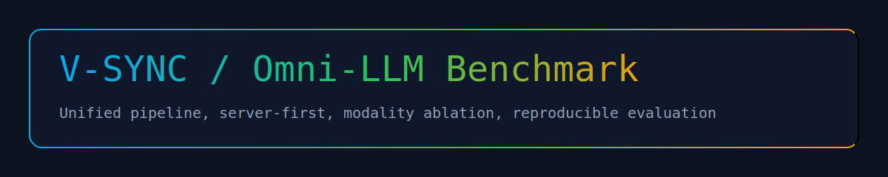
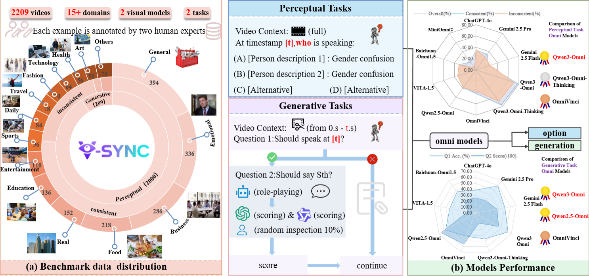

# V-SYNC: Perceiving When to Speak, A Diagnostic Benchmark for Omni Models



English | [中文](docs/README.zh-CN.md)

> A diagnostic benchmark that asks a simple but brutal question: **does your Omni model know *when* to speak?**

V-SYNC evaluates synchronized **audio-visual temporal grounding** rather than late fusion. Tasks are built so that **single-modality shortcuts fail**; only a native, unified perception stack can consistently answer correctly.

This repository is a production-ready refactor based on the original AV-SyncBench/omni_benchmark project, and **shares the same evaluation results and task philosophy**, while standardizing configuration, model servers, and pipeline entrypoints for release.

Full Chinese documentation: `docs/README.zh-CN.md`.

---

## Table of Contents

- [Why V-SYNC](#why-v-sync)
- [Design Philosophy](#design-philosophy)
- [Benchmark Results](#benchmark-results)
- [System Overview](#system-overview)
- [Quick Start](#quick-start)
  - [Prerequisites](#prerequisites)
  - [Configuration](#configuration)
- [Run Local Model Servers](#run-local-model-servers)
- [Benchmark (Level1)](#benchmark-level1)
- [Modality Ablation](#modality-ablation)
- [Configuration Map](#configuration-map)
- [Project Layout](#project-layout)
- [Level2 / Level3](#level2--level3)
- [API Models](#api-models)

---

## Why V-SYNC

Most multimodal benchmarks test *what* a model understands. V-SYNC tests **when** it understands:

- **Temporal binding**: can the model align the right voice with the right moment?
- **Cross-stream dependency**: tasks are designed to be unsolvable by a single modality
- **Native omni reasoning**: avoids post-hoc fusion; requires synchronized perception

If a model scores highly here, it is not just “multimodal” — it is **timing-aware**.

---

## Design Philosophy

V-SYNC is intentionally *diagnostic*, not purely benchmark-driven:

- **Minimalist task surface**: simple question formats that directly probe synchronized understanding
- **Single-modality insolubility**: audio-only or video-only reasoning should fail by design
- **Temporal precision**: each instance is tied to a specific time window
- **Evaluation as a pipeline**: server-first, config-driven, resume-friendly

---

## Benchmark Results

This repository includes the evaluation settings and datasets used in V-SYNC.

| Model | Accuracy |
|-------|----------|
| Qwen3-Omni | 77.6% |
| GPT-4o | 33.0% |
| Gemini 2.5 Flash | 21.0% |

---

## System Overview



```
[Dataset + ASR] -> [Pipeline] -> [Model Client] -> [HTTP Server] -> [Omni Model]
                         |                 |
                         |                 +-- Local servers (Qwen/OmniVinci/MiniOmni2)
                         +-- API clients (GPT-4o / Gemini)
```

- **Server-first**: local models are always accessed via HTTP
- **Unified pipeline**: identical evaluation flow across local + API models
- **Modality switch**: audio/video controls are centralized and consistent

---

## Quick Start

### Prerequisites

- Python >= 3.10
- CUDA-compatible GPU (for local model serving)
- uv package manager

```bash
uv sync
```

### Configuration

All settings live in `config/config.yaml`. Sensitive values go to `config/.env` or environment variables.

Key areas:
- API keys / base URLs
- model params (temperature / top_p / max_tokens)
- model paths, GPU IDs, server_url
- prompts and pipeline modality

---

## Run Local Model Servers

Each model exposes a single server entry (no unified/local inference scripts).

```bash
uv run models/model_server/omnivinci/omnivinci_server.py
uv run models/model_server/qwen2_5_omni/qwen_omni_server.py
uv run models/model_server/qwen3_omni/qwen3_omni_server.py
uv run models/model_server/qwen3_omni_thinking/qwen3_omni_thinking_server.py
uv run models/model_server/miniomni_2/miniomni2_server.py
```

---

## Benchmark (Level1)

```bash
uv run run_benchmark.py --model qwen3_omni
```

If results exist, the runner will prompt for resume.

---

## Modality Ablation

`benchmark.level1.modality` in `config/config.yaml` controls inputs:

- `avt`: audio + video (default)
- `vt`: video only
- `at`: audio only

API models simulate this by sending frames and/or ASR text. Local models disable the corresponding inputs.

---

## Configuration Map

| Area | Key | Example |
|------|-----|---------|
| API | `api.openai.base_url` | `https://.../v1` |
| API | `api.openai.api_key` | from `.env` |
| Model | `models.<name>.model_path` | `/publicssd/...` |
| Model | `models.<name>.gpu_ids` | `[6,7]` |
| Model | `models.<name>.server_url` | `http://127.0.0.1:5091` |
| Runtime | `runtime.max_retries` | `5` |
| Runtime | `runtime.frame_interval_sec` | `1` |
| Pipeline | `benchmark.level1.modality` | `avt / vt / at` |

---

## Project Layout

```
V_SYNC/
├── models/            # model servers, clients, shared utils
├── data/              # datasets (local)
├── tools/             # analysis / experiments / data tools (ignored in git)
├── config/            # config + env
├── results/           # outputs (local)
├── docs/              # documentation
├── run_benchmark.py   # Level1 runner
├── run_benchmark_level2.py
├── run_benchmark_level3.py
└── README.md
```

---

## Level2 / Level3

Entry points are prepared:

```bash
uv run run_benchmark_level2.py --model qwen3_omni
uv run run_benchmark_level3.py --model qwen3_omni
```

Implement `models/pipeline/level2_pipeline.py` / `level3_pipeline.py` and export them in `models/pipeline/__init__.py` when ready.

---

## API Models

For API models (GPT-4o / Gemini), configure:

```
OPENAI_API_BASE=...
OPENAI_API_KEY=...
```

The OpenAI-compatible client reads these from `.env` or environment variables.

---

## FAQ

**Q: Does V-SYNC require both audio and video?**
A: Yes, by design. The benchmark is built so single-modality reasoning fails. You can still run ablations via `modality`.

**Q: Why server-first?**
A: To standardize evaluation across local and API models and avoid hidden local-only behavior.

**Q: Can I resume runs?**
A: Yes. The runner detects existing result files and prompts for resume.

---

## Citation

```bibtex
@misc{vsync2025,
  title={V-SYNC: Perceiving When to Speak, A Diagnostic Benchmark for Omni Models},
  author={Alexisxty},
  year={2025},
  url={https://github.com/Alexisxty/V-SYNC}
}
```
